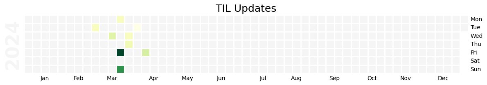

## Today I Learned

> Today I Learned - A list of all things I learn on daily basis.

This repository is inspired by [jbranchaud/til](https://github.com/jbranchaud/til) and [adoyle-h/Today-I-Learned](https://github.com/adoyle-h/Today-I-Learned). It is a collection  of concise write-ups about discoveries I make in various technologies on a day-to-day basis. These write-ups aim to be informative, easily digestible, and cover a broad spectrum of topics accumulated over time.

You can read these TILs at [lijohnny.com/Today-I-Learned/](https://lijohnny.com/Today-I-Learned/) for a better reading experience, or search for specific topics.or use the search functionality to find specific topics.

## About  

This repository utilizes a minimal template for creating a site with the [Just the Docs](https://just-the-docs.github.io/just-the-docs/) theme. To streamline the documentation process, I've developed Python scripts to automate various tasks, including the generating meta header for each Markdown file and the creating of `index.md` files in each folder to facilitate Jekyll's menu generation. If you are intrested, you can check [_doc_builder](/_doc_builder/) folder.

## Feedback

If you have any comments or ideas, please share them in the [Discussions](https://github.com/itslijohnny/Today-I-Learned/discussions) section. I appreciate your input and strive to continuously improve this repository based on your insights.

If you find this repository useful, please consider starring it. Additionally, stay updated on the latest update by following [@lijohnnyds](https://twitter.com/lijohnnyds) on Twitter.

## Tracker

------
## TOC
<!-- toc -->
<!-- 
 -->
<!-- 
Collapse/Expand
 -->
- [Web](#web)
  - [Jekyll](#jekyll)
- [Math](#math)
  - [Algebra](#algebra)
- [Obsidian](#obsidian)
- [Docker](#docker)
- [Machine Learning](#machine-learning)
- [Python](#python)
- [Github](#github)

<!-- 
 -->
<!-- tocstop -->
------
## Web
#### Jekyll
- [Run Jekyll in Docker](web/jekyll/run-jekyll-in-docker.md)

[`⬆ Back to TOC`](#toc)
## Math
#### Algebra
- [Linear Algebra](math/algebra/linear-algebra.md)

[`⬆ Back to TOC`](#toc)
## Obsidian
- [Tour 一起看看Linan是怎么在Obsidian里记学术笔记和做日程管理的](obsidian/tour-一起看看linan是怎么在obsidian里记学术笔记和做日程管理的.md)
- [Obsidian - The Basics of Taking Notes - Effective Remote Work](obsidian/obsidian-the-basics-of-taking-notes-effective-remote-work.md)

[`⬆ Back to TOC`](#toc)
## Docker
- [Docker compose](docker/docker-compose.md)

[`⬆ Back to TOC`](#toc)
## Machine Learning
- [Zero Shot Learning](ml/zero-shot-model.md)
- [Date related dataset and package.md  ](ml/date-related-dataset-and-package.md)
- [Donut Model](ml/dount_model.md)

[`⬆ Back to TOC`](#toc)
## Python
- [Generate requirement.txt file](python/generate-requirement.md)
- [remove-non-numeric-string](python/.md)
- [How to get file modify date/time](python/how-to-get-file-modify-datetime.md)
- [How to use dateparser](python/how-to-use-dateparser.md)
- [a quick way to find the index of item in list](python/find-index.md)

[`⬆ Back to TOC`](#toc)
## Github
- [GitHub Checkout Action Preserve File Modification Time](github/restore_file_datetime.md)

[`⬆ Back to TOC`](#toc)